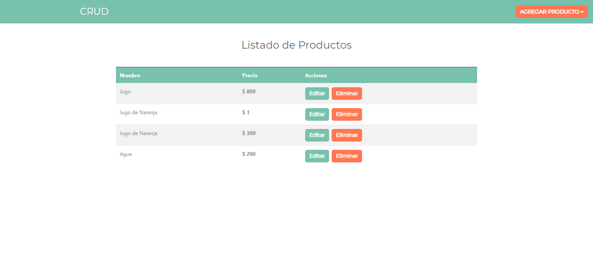

<h1>CRUD Redux Application</h1>
<h2>Description</h2>
<p>Small application CRUD with Redux</p>
<h2>Languages</h2>
<ul>
  <li>HTML</li>
  <li>CSS</li>
  <li>JS</li>
</ul>
<h2>Tools</h2>
<ul>
  <li>React</li>
  <li>Hooks</li>
  <li>Redux</li>
  <li>React Router Dom</li>
  <li>Bootstrap</li>
  <li>Sweetalert2</li>
  <li>Axios</li>
  <li>json-server</li>
</ul>
<h2>Installation</h2>

```
npm install
```

<h2>Run the project</h2>

```
npm run start
```
<h2>Previews</h2>


